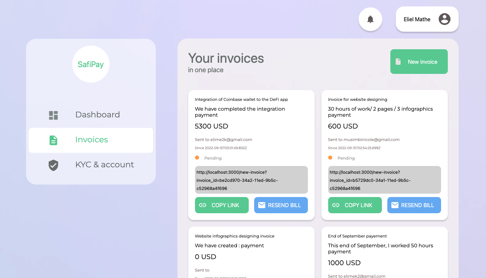

# About SAFI Pay

## Introduction 

We are currently living in a period of unprecedented globalization. Employers are looking for workers in several countries to increase productivity.
Globalization has many problems in developing countries, especially in the area of payments: for many remote workers, due to banking restrictions, they are unable to get paid and must either open a bank account in another country where payments are accepted or find local opportunities that often do not pay well.

Many of us have experienced this problem and for this hackaton, we understood that several tools are available to us to develop an efficient solution to solve this problem including: 
- Blockchain technology (with stable coins)
- IPFS technology to store data in a totally distributed way 
- Tenderly technology to notify events that take place on the smart contract 
- ReactJS to create an easy to use interface for multiple people through smartphones or computers
- Coinbase wallet to make money transfers on the blockchain

Thus, we created SAFIPAY, an easy to use application allowing verified users in African and other countries to have a single place to create and send invoices to employers. These employers have the possibility, thanks to stablecoins to pay their workers who can withdraw money either by mobile money, money transfer or deposit on their accounts on DeFi.

## Flow 

Here is the flow of use of the application: 
1. The employee creates a user account and is verified by KYC

2. The worker generates an invoice and fills in the employer's email 

3. Employee clicks on the link received by email 

4. Employer connects with CoinBase Wallet to pay 

5. Thanks to tenderly, we get notified of the action and send notification to the user.

5. The employee receives an email or a text message that the payment has been made and where to withdraw the money.

## Business Model 

We intend to make money by charging commissions on payments through SafiPay

## Other applications

SafiPay will also be able to allow other types of transactions besides bill payments, but also other fund transfers from stablecoins to the means of payment in several developing countries.

SafiPay, having verified users, will also give employers confidence in even more remote workers.

## Future

In the future, SafiPay will have an enterprise tool to automate payments over periods of time (months, weeks) to specific employees but also for employees to generate invoices automatically.

## Demo 

Test our [demo application here](https://safipay.vercel.app) 

## Team 

David Kathoh - [Twitter](https://twitter.com/DavidKathoh) - [Github](https://github.com/davidkathoh)  
Pacifique Linjanja - [Twitter](https://twitter.com/PacifiqueLinja1) - [Github](https://github.com/pacyL2K19)   
Eliel Mathe - [Twitter](https://twitter.com/elielmathe) - [Github](https://github.com/elielnfinic)  

## Contact us   

Send us an email here [safipay@nfinic.com](safipay@nfinic.com)

    
 
 
 
 
 
 
   

# SAFIPay - Frontend project

Built with

- React & NextJS
- Typescript
- scss